# Flutter Blog App

Alhamdulillah, this is a fully functional **Blog App** built using **Flutter** and **Firebase**. The app allows users to create profiles, post content, interact with others, and receive notifications.

---

## Features

### Profile View
- Create and update user profile.
- View total posts, total reactions, and total followers.
- View list of followers.
- View list of users who have sent messages.
- Interact with other users by sending messages.

### Home View
- Create and view posts.
- Update and delete posts.
- View other users' posts.
- Comment and react (love) on posts.
- Visit other users' profiles.
- Follow and send messages to other users from their profile.
- global chat system (many-to-many)
- one-to-one chat system
- Notifications bar to see:
  - Users who reacted or commented on your posts.
  - Users who have followed.

---
## 📸 App UI Preview

<p align="center">
  <h3>Login screen</h3>
  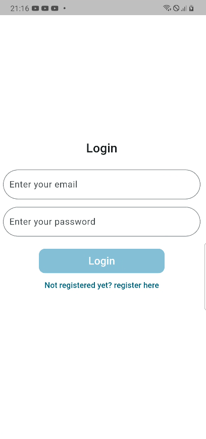
  <h3>Register screen</h3>
  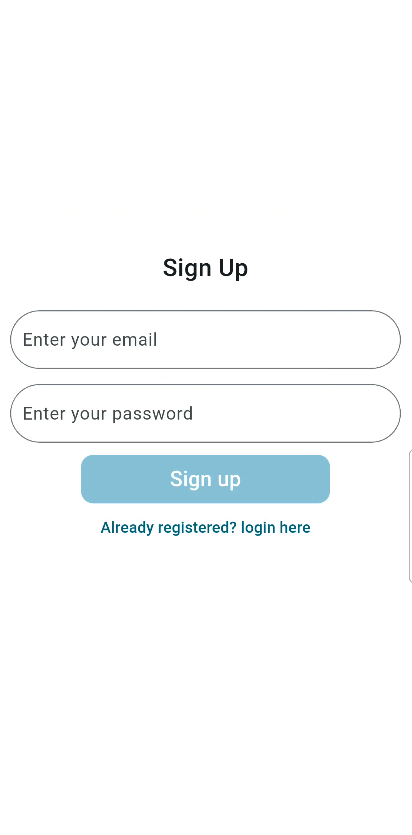
  <h3>Profile screen</h3>
  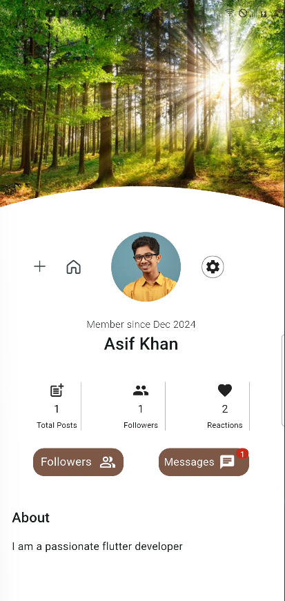
</p>

<p align="center">
  <h3>All Followers</h3>
  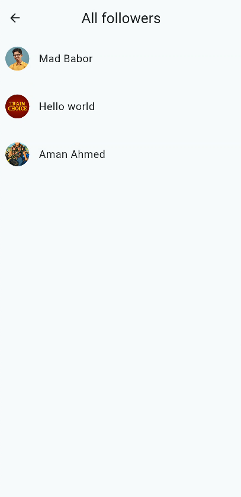
    <h3>All Messages</h3>
  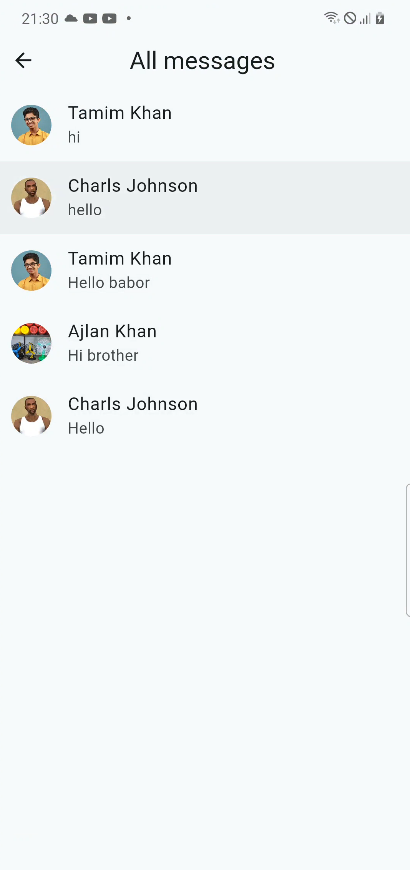
    <h3>Home Screen</h3>
  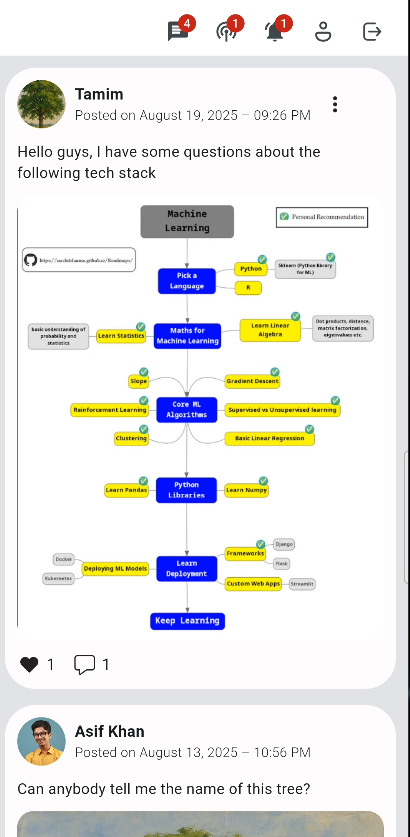
    <h3>Post Comment</h3>
  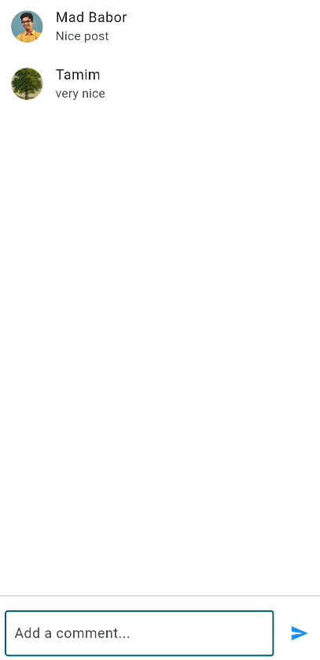
</p>

<p align="center">
  <h3>Home User profile</h3>
  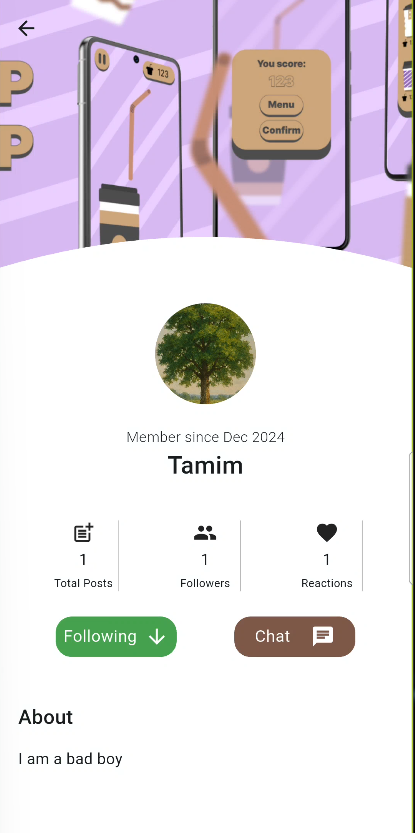
    <h3>One-to-One to chat</h3>
  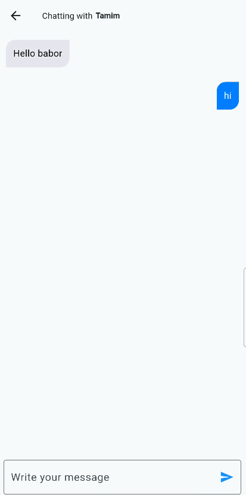
    <h3>Global Chatroom</h3>
  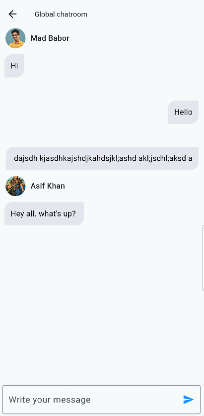
    <h3>Reaction notification</h3>
  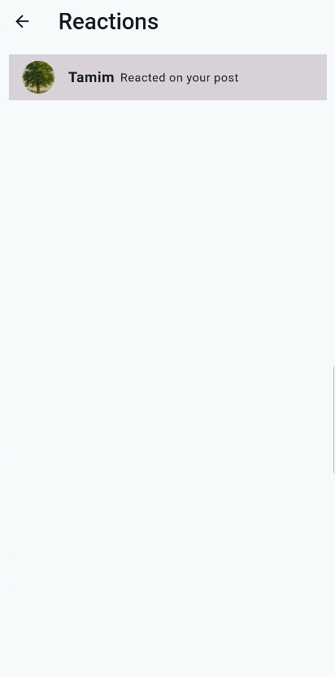
    <h3>Followers notification</h3>
  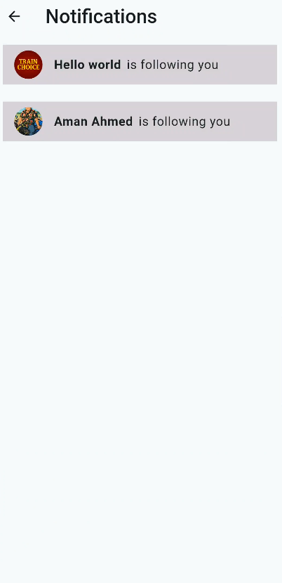
</p>

---
## Packages Used

```yaml
firebase_core: ^4.0.0
firebase_auth: ^6.0.0
firebase_analytics: ^12.0.0
cloud_firestore: ^6.0.0
provider: ^6.1.5
cloudinary_flutter: ^1.0.0
cloudinary_url_gen: ^1.0.0
image_picker: ^1.1.2
path: ^1.8.3
mime: ^1.0.4
http_parser: ^4.0.2
dotted_border: ^3.1.0
fluentui_system_icons: ^1.1.273
get_storage: ^2.1.1
intl: ^0.20.2
http: ^1.5.0
loading_animation_widget: ^1.3.0
flutter_hooks: ^0.21.3
